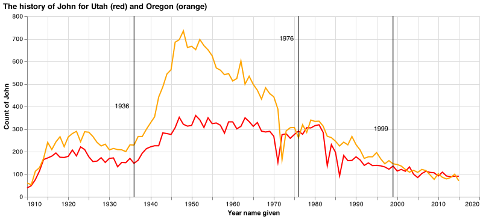

## Details

This coding challenge will help you practice skills required for the final coding challenge. Remember:

1. Your goal is to demonstrate your data science coding abilities. Get through as many items with a rough implementation as possible.
2. Get your code to match our outputs as close as possible, but don't stress over minute details.
3. Keep most of the code you type.  If you end up not using specific parts, comment them out and include them at the bottom.
4. You should use the entire hour and may not finish.
3. While not required for the practice, you'll need to budget time to submit a `.md` and a `.pdf` report for the final challenge.  

__Please use the [challenge template](https://byuistats.github.io/CSE250-Course/template/challenge_template.md) to submit your work.__

```python
import pandas as pd 
import altair as alt
import numpy as np

from sklearn.model_selection import train_test_split
from sklearn import tree
from sklearn.ensemble import GradientBoostingClassifier
from sklearn import metrics
```


## Challenge 1

A man, his son, and a grandson are all named John.  The man was born in 1936, the son in 1976, and the grandson was born in 1999. The man and grandson were born in Utah, but the son was born in Oregon.  Recreate the following graphic to show this story about our names.
```python
url_names = 'https://github.com/byuidatascience/data4names/raw/master/data-raw/names_year/names_year.csv'
dat_names = pd.read_csv(url_names)

```




## Challenge 2

Our computations can't be done with missing values. Take the following series and calculate the mean after replacing the missing values with the median. 

```python
mister = pd.Series([np.nan, 15, 22, 45, 31, np.nan, 85, 38, 129, 8000, 21, 2])
```

## Challenge 3

Create a table of building counts for houses of 1 and 2 stories (in the rows of the table) and with a garage that fits 1,2,3 and 4 cars or less (the columns of the table) from the `dwellings_ml` data. __Show the markdown table and the clean table in your report.__  The [pivot_table](https://pandas.pydata.org/pandas-docs/stable/reference/api/pandas.pivot_table.html#pandas.pivot_table) function could prove valuable as well as [groupby](https://pandas.pydata.org/pandas-docs/stable/reference/api/pandas.DataFrame.groupby.html) and [agg](https://pandas.pydata.org/pandas-docs/stable/reference/api/pandas.DataFrame.agg.html).


```python
dwellings_ml = pd.read_csv("https://github.com/byuidatascience/data4dwellings/raw/master/data-raw/dwellings_ml/dwellings_ml.csv")
```

## Challenge 4

Your data has too many types of values for missing. All the values are counts of mice in a bucket. Fix the series to all be `np.nan` and calculate the average.

```python
mother = pd.Series(['N/A', 15, 22, 45, 31, -999, 21, 2, 0, 0, 0, 'broken'])
```

## Challenge 5

We want to predict whether a home has a basement or not using our Denver homes data. Report your accuracy.  Here are a few key inputs

1. Use `test_size = .20` and `random_state = 2022` in `train_test_split()`
2. Use the `GradientBoostingClassifier()` method.

```python
dwellings_ml = pd.read_csv("https://github.com/byuidatascience/data4dwellings/raw/master/data-raw/dwellings_ml/dwellings_ml.csv")

X_pred = dwellings_ml.drop(dwellings_ml.filter(regex = 'basement|finbsmnt|BASEMENT').columns, axis = 1)

y_pred = dwellings_ml.basement
y_pred[y_pred > 0] = 1  

```
